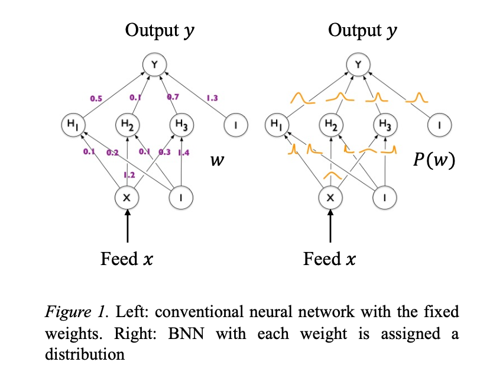

The review is done with the following paper: 
[Luis Basora, , Arthur Viens, Manuel Arias Chao, and Xavier Olive. "A Benchmark on Uncertainty Quantification for Deep Learning Prognostics." (2023).](https://arxiv.org/abs/2302.04730)

# A Benchmark on Uncertainty Quantification for Deep Learning Prognostics

## Table of Contents

1. [Abstract of the paper](#abstract-of-the-paper)
2. [Bayesian Neural Network](#bayesian-neural-network)
   - [Bayes Theorem](#bayes-theorem)
   - [Variational Inference](#variational-inference)
   - [Kullback-Leibler Divergence](#kullback-leibler-divergence)
   - [Bayes by Backprop.](#bayes-by-backprop.)
3. [Backpropagation Methods](#backpropagation-methods)
4. [Dataset Explanation](#dataset-explanation)
5. [Model Architecture](#model-architecture)
6. [Training Phase](#training-phase)
7. [Evalution and Results](#evaluation-and-results)
8. [Conclusion](#conclusion)

---

### Abstract of the paper

The following paper contains the assessment of the latest uncertainty quantification (UQ) methods for prognostics in deep learning (DL). 

- UQ assessment: remaining useful lifetime (RUL) prediction
  - NASA’s N-CMAPSS dataset
- Methods or techniques will be used for the assessment:
  - Bayesian Neural Network (BNN) ... will be focusing on BNN only
  - Monte Carlo Dropout (MCD)
  - Heteroscedastic Neural Network (HNN)
  - Deep Ensemble (DE)

---

### Bayesian Neural Network

#### Bayes Theorem

see [Bayes' Theorem](https://3seoksw.github.io/blog/2023/bayes-theorem/). 

$$
\begin{align}
    \text{Posterior} \propto \text{Prior} \times \text{Likelihood} \\
    P(A|B) = \frac{P(B|A)\times P(A)}{P(B)} \\
    P(w|\mathcal{D}) \propto P(\mathcal{D}|w) \times P(w) \\
\end{align}
$$

    

#### Variational Inference

$$P(w|\mathcal{D}) \propto P(\mathcal{D}|w) \times P(w)$$

#### Kullback-Leibler Divergence

#### Bayes by Backprop.

---

### Backpropagation Methods

---

### Dataset Explanation

---

### Model Architecture

---

### Training Phase

---

### Evaluation and Results

---

### Conclusion

---
